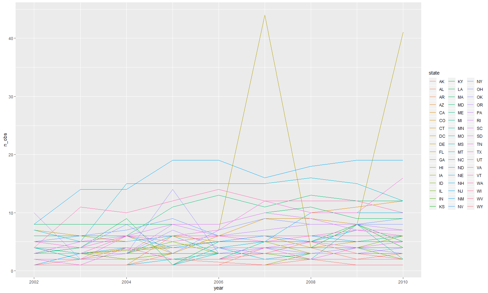
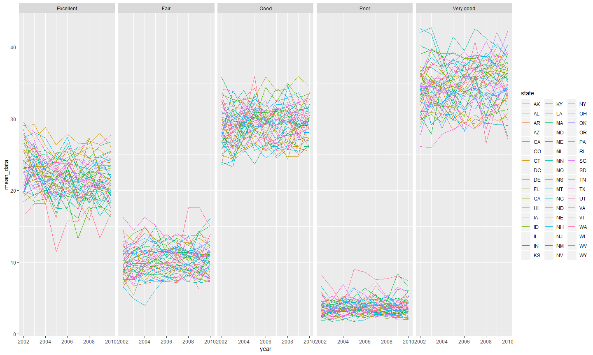
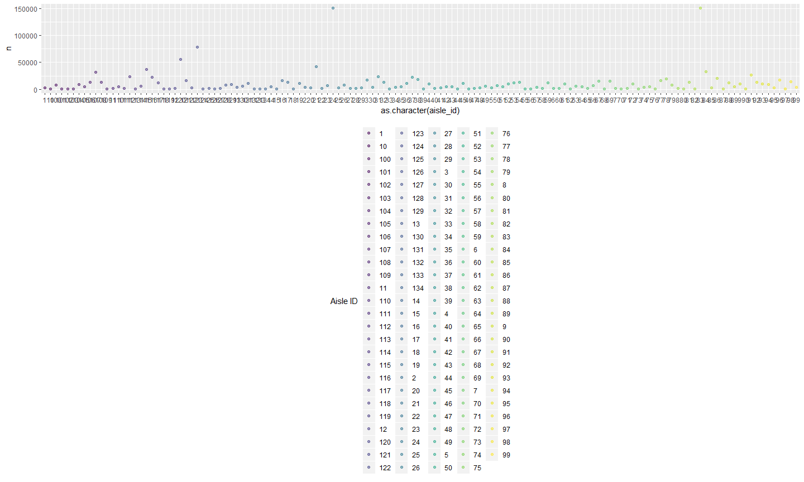

hw3\_yg2625
================
Yue Gu
October 13, 2018

Problem 1
=========

Data Cleaning
-------------

``` r
data(brfss_smart2010)
brfss_data = 
  brfss_smart2010 %>% 
  janitor::clean_names() %>% 
  rename(.data = ., state = locationabbr, county = locationdesc) %>% 
  filter(.data = ., topic == "Overall Health", response == "Excellent" || response == "Very good" || response == "Good" || response == "Fair" || reponse == "Poor") %>% 
  mutate(.data = ., response = as.factor(response)) %>% 
  arrange(.data = .,  match(response,c("Excellent", "Very good", "Good", "Fair", "Poor")))
```

Answering questions
-------------------

``` r
brfss_data %>% 
  filter(year == 2002) %>% 
  group_by(state) %>% 
  summarize(n_obs = n_distinct(county) == 7) %>% 
  filter(n_obs == T)
```

    ## # A tibble: 3 x 2
    ##   state n_obs
    ##   <chr> <lgl>
    ## 1 CT    TRUE 
    ## 2 FL    TRUE 
    ## 3 NC    TRUE

``` r
brfss_data %>% 
  group_by(year, state) %>% 
  summarize(n_obs = n_distinct(county)) %>%
  ggplot(aes(x = year, y = n_obs, color = state)) + geom_line()
```



``` r
brfss_data %>% 
  filter(.data = ., response == "Excellent", state == "NY", year == "2002"|year == "2006"|year == "2010") %>%
  group_by(year, state) %>% 
  summarize(mean_data = mean(data_value)，
            sd_data = sd(data_value)) %>% 
  knitr::kable(digits = 2)
```

|  year| state |  mean\_data|  sd\_data|
|-----:|:------|-----------:|---------:|
|  2002| NY    |       24.04|      4.49|
|  2006| NY    |       22.53|      4.00|
|  2010| NY    |       22.70|      3.57|

``` r
brfss_data %>% 
  group_by(year, state, response) %>% 
  summarize(mean_data = mean(data_value)) %>% 
  ggplot(aes(x = year, y = mean_data, color = state)) + 
    geom_line() + 
    facet_grid(.~response)
```

    ## Warning: Removed 2 rows containing missing values (geom_path).



Problem 2
=========

Description of exploration
--------------------------

``` r
data("instacart")
insta_data =
  instacart
  

dim(insta_data)
```

    ## [1] 1384617      15

``` r
n_distinct(insta_data$order_id)
```

    ## [1] 131209

``` r
n_distinct(insta_data$product_id)
```

    ## [1] 39123

``` r
n_distinct(insta_data$user_id)
```

    ## [1] 131209

``` r
n_distinct(insta_data$aisle_id)
```

    ## [1] 134

``` r
n_distinct(insta_data$department_id)
```

    ## [1] 21

Aisles
------

``` r
n_distinct(insta_data$aisle)
```

    ## [1] 134

``` r
head(arrange(count(insta_data, aisle_id), desc(n)), n = 1)
```

    ## # A tibble: 1 x 2
    ##   aisle_id      n
    ##      <int>  <int>
    ## 1       83 150609

``` r
## Plot
insta_data %>% 
  group_by(aisle_id) %>% 
  summarize(n = n()) %>% 
  ggplot(aes(x = as.character(aisle_id), y = n, color = as.character(aisle_id))) +
    geom_point(alpha = 0.5) +
    viridis::scale_color_viridis(
    name = "Aisle ID", 
    discrete = TRUE
  ) + 
    theme(legend.position = "bottom")
```



``` r
## Table for most pop items
insta_data %>% 
  filter(.data = ., aisle == "baking ingredients" | aisle == "dog food care" | aisle == "packaged vegetables fruits") %>% 
  group_by(aisle, product_name) %>%
  summarize(n = n()) %>% 
  filter(min_rank(desc(n)) == 1) %>% 
  knitr::kable()
```

| aisle                      | product\_name                                 |     n|
|:---------------------------|:----------------------------------------------|-----:|
| baking ingredients         | Light Brown Sugar                             |   499|
| dog food care              | Snack Sticks Chicken & Rice Recipe Dog Treats |    30|
| packaged vegetables fruits | Organic Baby Spinach                          |  9784|

``` r
## Table for hr of the day
insta_data %>% 
  filter(.data = ., product_name == "Pink Lady Apples" | product_name == "Coffee Ice Cream") %>% 
  group_by(order_dow, product_name) %>% 
  summarize(mean_hr = mean(order_hour_of_day)) %>% 
  spread(key = order_dow, value = mean_hr) %>%
  rename(Mon = "0", Tues = "1", Wed = "2", Thrs = "3", Fri = "4", Sat = "5", Sun = "6", Product = product_name) %>% 
  knitr::kable(digit = 2)
```

| Product          |    Mon|   Tues|    Wed|   Thrs|    Fri|    Sat|    Sun|
|:-----------------|------:|------:|------:|------:|------:|------:|------:|
| Coffee Ice Cream |  13.77|  14.32|  15.38|  15.32|  15.22|  12.26|  13.83|
| Pink Lady Apples |  13.44|  11.36|  11.70|  14.25|  11.55|  12.78|  11.94|
